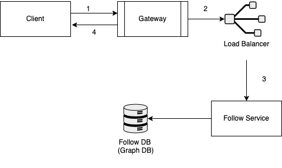
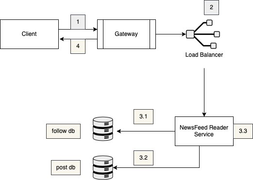
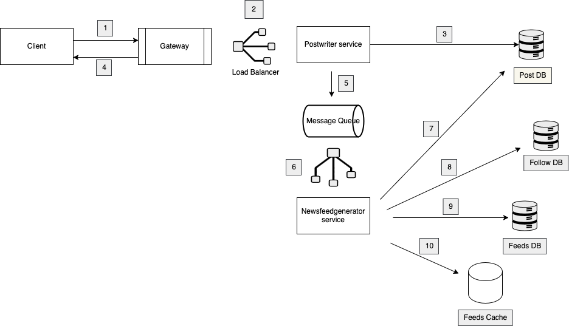
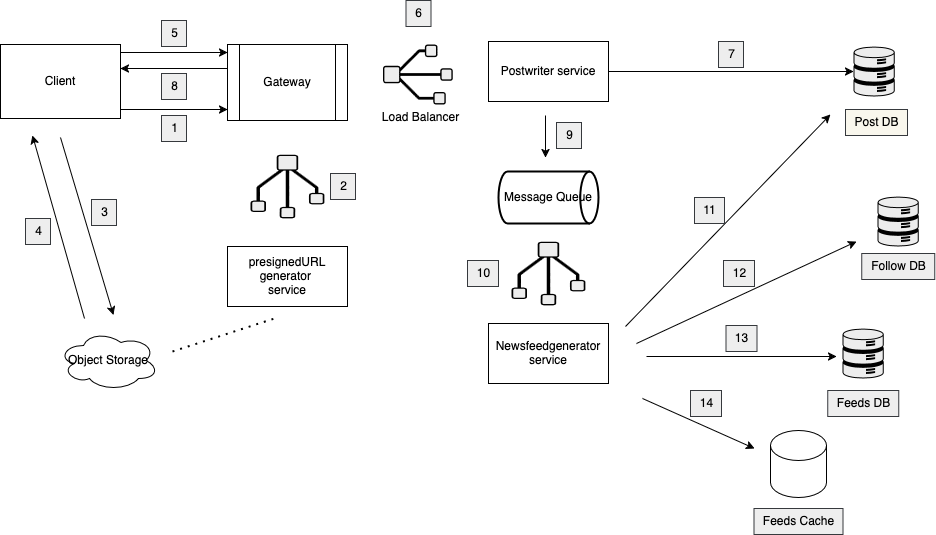
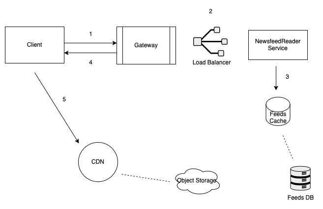
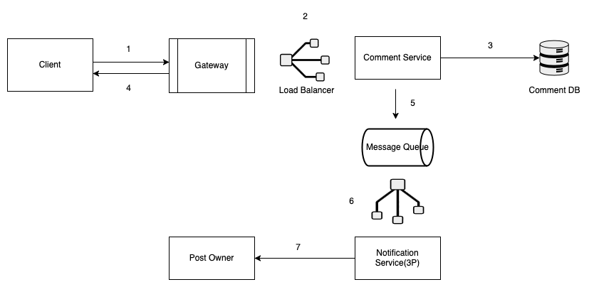
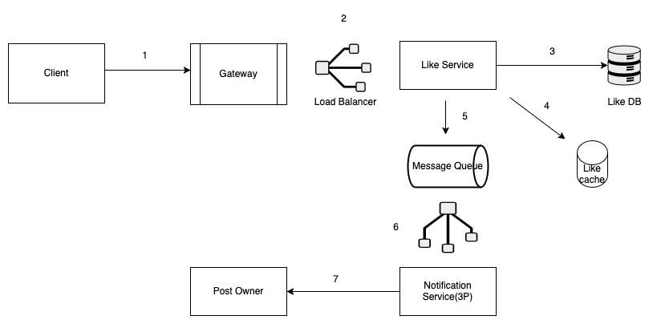

### Requirements

#### Functional Requirements
- **Social Media Post**: can be text, video, images  
- **Follow/unfollow other users**:  
- **News Feed**: feed from users that they follow in reverse chronological Order (Newest to Oldest)  
- **Like and Comment on other people's post**:  
- **User Notification**: user gets notification when another user likes or comments on the post  

#### Non-Functional Requirements
- **Availability**: should be highly available - 99.999% uptime  
- **Consistency**: eventual consistency, if the user posts something, it's okay if it doesn't show up immediately but appears within a few seconds (1 - 2 seconds)  
- **Latency**: if we click on home button newsfeed should load in 1 - 2 seconds  
- **Scalability**: the system should scale through the globe (500M DAU and 2B MAU)  
- **Extensibility**: easier to extend it in the future. If we need to add features like replying to a comment, post recommendations, or ads  
- **Usability**: for newsfeed system rendering should be super fast

---

### Capacity Estimation

#### DAU/MAU
- **DAU**: 500 million
- **MAU**: 2 Billion

#### Throughput
- **Write**
    1. **Creating Post**: 10% users post every day = 50 million / day
    2. **Following**
    3. **Commenting or Liking**
- **Read**
    - **Reading News Feed**: Single user watches 100 posts a day = 50 Billion / day

#### Storage
- **What we are storing**
    - **Posts**
        - Assumptions/day: 
            - Video: 20MB, 20% = 200TB
            - Images: 0.5MB, 60% = 15TB
            - Text Posts: 100KB, 20% = 1TB

#### Network & Bandwidth Estimation
- **Ingress**: (216 TB) / (24 × 60 × 60) ≈ **2.5 GB/second**
- **Egress**: 0.2 × 100 KB + 0.2 × 20 MB + 0.5 × 0.5 MB = **4.32 MB** per user per day
    - (50 billion × 4.32 MB) / (24 × 60 × 60) ≈ **2.5 TB/second**

#### API Design
- **Create a text post**
    - Method: POST
    - Endpoint: `/v1/posts`
    - HTTP Body:
      ```json
      {
        "userId": "abc",
        "description": "Excited for the europe trip",
        "hashtag": ["travel", "fun"]
      }
      ```
- **Create image/video post**
    - Image/video will be uploaded on object storage
    - Method: POST
    - Endpoint: `/v1/posts`
    - HTTP Body:
      ```json
      {
        "userId": "abc",
        "mediaUrl": "s3url", // url from object storage
        "description": "Relaxing",
        "hashtags": ["relax", "chilling"]
      }
      ```
- **Like/Comment on a post**
    - Method: POST
    - Endpoint: `/v1/comments`
    - HTTP Body:
      ```json
      {
        "userId": "abc",
        "postId": "1234",
        "comment": "Beautiful! Great Shot"
      }
      ```
- **Follow/Unfollow another user**
    - Method: POST
    - Endpoint: `/v1/follow`
    - HTTP Body:
      ```json
      {
        "followerId": "abc",
        "followingId": "def"
      }
      ```
- **Read the news feed**
    - Method: GET
    - Endpoint: `/v1/feeds/{userId}`


#### High Level Design

- **Follow/Unfollow another user**
  
  
  - Graph DB stores follower and followee relationship efficiently.
  - Graph DB is specialized in storing relationship between data.

- **Create a text post**
  - Design is similar to in1.png except DB is not graph DB
  - Flow: client → API gateway → Load balancer → Postwriter Service → Post DB, API gateway → client

- **Read a news feed**
  
  
  - NewsFeedReader Service first finds all the users followed, then gets all the posts, then orders in reverse chronological order.

  **Optimizing**
  
  
  - Prepare news feed in advance
  - Once a post arrives in PostWriter Service, it also adds the {postId, userId} in message queue (MQ) after post is added in Post DB
  - NewsFeedGenerator (NFG) service is responsible for creating newsfeed for all users
  - NFG service pulls the message from MQ
  - NFG gets new post from Post DB, finds all the followers from Follow DB, adds the new feed to all the following users in Feed DB
  - The same info is updated in cache

- **Create an image/video post**
  
  
  - Client requests a presigned URL to upload the image/video. A presigned URL allows the client to upload content directly to object storage.
  - API gateway routes the request to the presigned URL generator service, which generates the URL and returns it to the client.
  - Client uploads the content directly to object storage; object storage returns the URL of the uploaded content to the client.
  - Client requests for the post feed to the API gateway with the {postId, userId, mediaUrl}. The following steps are similar to the create text post request

- **Read the newsfeed**
  
  
  - Client requests the read post API; API gateway forwards the request to NewsFeed Reader (NFR) service.
  - NFR fetches the pre-built news feed from feed cache and sends this newsfeed to the client.
  - The newsfeed that the client receives contains the URL for the media, not the actual content.
  - Client fetches the media from the CDN; if content is not present in CDN, then it pulls from the object storage.
  - The text reaches first, and for media, the client has to reach out to the CDN.

- **Comment on the post**
  
  
  - Post request sent from client; API gateway routes it to the comment service
  - Comment service processes this comment and stores it in comment DB
  - After saving to comment DB, client receives the confirmation from the comment service
  - Comment service pushes the event {userId, postId} in the message queue
  - Notification service pulls this event and notifies the owner (can be a 3rd party service)

- **Like a post**
  
  
  - Post request sent from client; API gateway routes it to the like service
  - Like service processes this like and stores it in Like DB
  - Like service updates the like cache as well. This cache contains the mapping between the post and their like count.
  - Like service pushes the event {userId, postId} in the message queue
  - Notification service pulls this event and notifies the owner (can be a 3rd party service)

  #### Deep Dive Insights
  - **Database Selection**
    - **Posts DB**: Stores posts with no fixed structure (text, images, video—some posts may have one or more types, some may have none). **Scale:** ~50 million requests/day. **Query Pattern:** Simple (fetch by postId). **Recommended:** NoSQL DB (e.g., DynamoDB, Cassandra) for flexibility and scalability.
    - **Feeds DB**: Maps userId to news feed (feeds depend on Post DB). **Scale:** ~50 million requests/day. **Query Pattern:** Simple (fetch feed by userId). **Recommended:** NoSQL DB for high write throughput and flexible schema.
    - **Comments DB**: Handles nested comments with no fixed schema. **Scale:** ~1.5 billion requests/day. **Query Pattern:** Simple (fetch all comments for a post). **Recommended:** NoSQL DB for handling large volumes and flexible, hierarchical data.
    - **Likes DB**: Data may evolve (e.g., new reactions). **Scale:** ~1.5 billion requests/day. **Query Pattern:** Simple (get like count, list users who liked a post). **Recommended:** NoSQL DB for scalability and schema evolution.
    - **Follow DB**: Stores user relationships. **Recommended:** Graph DB (e.g., Neo4j) to efficiently model and traverse user relationships (users as nodes, follows as edges). **Benefit:** Efficiently finds followers/following lists, handles large relationship graphs.

  **Summary Table:**

  | Database    | Data Type         | Scale                | Query Pattern             | Recommended DB |
  |-------------|------------------|----------------------|--------------------------|---------------|
  | Posts DB    | Unstructured     | 50M req/day          | By postId                | NoSQL         |
  | Feeds DB    | Unstructured     | 50M req/day          | By userId                | NoSQL         |
  | Comments DB | Hierarchical     | 1.5B req/day         | By postId (fetch all)    | NoSQL         |
  | Likes DB    | Evolving         | 1.5B req/day         | By postId/userId (count, list users) | NoSQL         |
  | Follow DB   | Graph/Relational | High (many-to-many)  | By userId (traverse graph) | Graph DB      |

  > **Tip:** Use NoSQL for flexible, high-scale, simple-access data. Use Graph DB for complex, highly-connected relationships.
