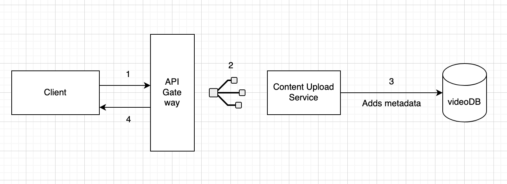
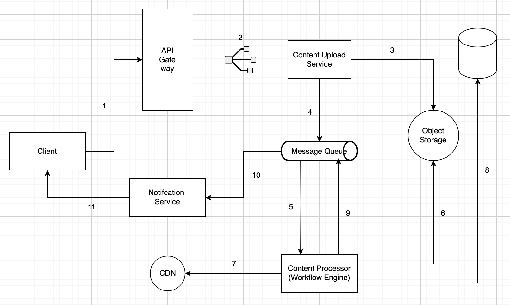
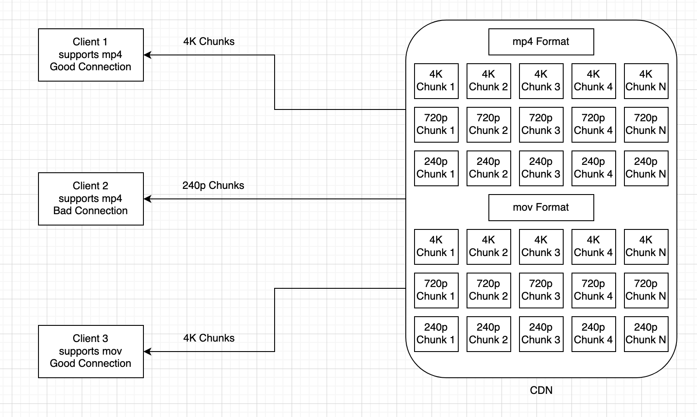
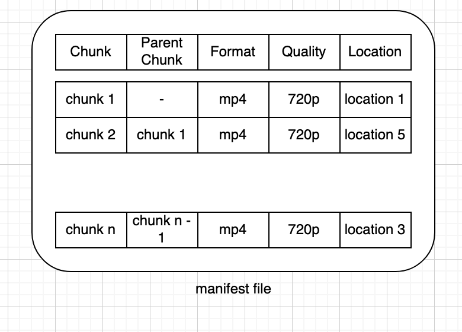

## Functional Requirements
- There are two types of users: **Viewers** and **Creators**.
    - **Viewers** will consume the content.
        - Streaming capability on multiple devices (mobile, laptop, computer, etc.).
    - **Creators** will create and upload content.
        - Should receive a notification upon upload completion.

## Non-Functional Requirements
- **Viewers:**
    - **Low latency:** Viewers should not wait long; low buffering and lag.
    - **Scalability:** Millions of users can watch videos simultaneously.
    - **User Experience:** Good internet = high quality; poor internet = lower quality streams.
    - **Availability:** System should be highly available (99.9999% uptime).
- **Content Creators:**
    - **Scalability:** System should handle many upload requests at the same time.
    - **Security:** Uploaded content must be secure; unauthorized access and piracy must be prevented.
    - **Storage Reliability:** Uploaded videos should not disappear; reliable storage

---

## Capacity Estimation
- **Delhi Active Users:** 100 million
- **Monthly Active Users:** 2.5 billion

### Throughput
- **Write Throughput:** 0.4 million users upload videos per day (100 million / 250 = 0.4 million write records)
- **Read Throughput:** 1 billion read requests per day (100 million users × 10 videos each)

### Storage
- Main storage is for video files; metadata is minimal compared to video data.
- Average video size: 600MB
- Daily uploads: 0.4 million × 600MB ≈ 240TB/day
- 10-year storage: 240TB × 365 × 10 ≈ 876PB
- Videos must be stored reliably and be highly available

### Memory
- Cache is used for popular videos and metadata
- 1% of daily storage cached: 1% × 240TB ≈ 2.4TB
- Caching reduces latency and backend load

### Network / Bandwidth Estimation
- **Ingress:** 240TB/day ≈ 2.7GB/sec
- **Egress:** 1B reads/day × 600MB = 600PB/day ≈ 7TB/sec
- Network must support high upload and streaming throughput

---

## API Design

### Upload Content (Resumable Uploads)
- Large videos (10 minutes to 2 hours) cannot be uploaded in a single request.
- The client uploads video data in small chunks using multiple requests.
- **Step 1:** Initiate upload
    - **Method:** POST
    - **Endpoint:** `/v1/videos?uploadType=resumable`
    - **Request Body:** Video metadata (title, format, etc.)
    - **Response:** Server returns a resumable session URL (with an upload ID)
- **Step 2:** Upload video chunks
    - **Method:** PUT
    - **Endpoint:** Resumable session URL (e.g., `/v1/videos?uploadType=resumable&uploadId=123`)
    - **Request Body:** Binary video data (chunk)
- The client repeats Step 2 until the entire video is uploaded.
- This approach allows for reliable, large uploads and recovery from network interruptions.

### Stream Content
- Videos are streamed in chunks rather than as a single large file.
- The server provides a manifest file (playlist) containing the locations of all video chunks.
- **Step 1:** Get manifest file
    - **Method:** GET
    - **Endpoint:** `/v1/watch?v={videoId}`
    - **Response:** Manifest file with chunk URLs
- **Step 2:** Fetch video chunks
    - **Method:** GET
    - **Endpoint:** Chunk URLs (provided in manifest)
    - Video chunks are stored in the CDN, not on the main server.
- **Protocol:** HLS (HTTP Live Streaming)
    - HLS enables adaptive streaming, adjusting video quality based on the client's internet speed for a smooth viewing experience.


## High Level Design

### Upload Content Flow
1. **Client Initiates Upload**
    - Client requests a resumable upload session.
    - Receives a session URL for uploading video chunks.
2. **Upload Video Chunks**
    - Client uploads video chunks via PUT requests to the session URL.
    - API Gateway routes requests to the Content Upload Service.
    - Content Upload Service stores video chunks in Object Storage.
3. **Content Delivery Service**
    - Once the upload is complete, Content Delivery Service adds an event to the message queue with the video ID.
4. **Content Processor Service**
    - Picks up the event from the message queue.
    - Retrieves the video from Object Storage.
    - Breaks the video into smaller chunks and processes them for different formats and resolutions.
    - Uploads processed chunks to Object Storage.
    - Updates chunk locations in the Video DB.
    - Adds an event to the message queue indicating processing is complete.
5. **CDN Uploader Service**
    - Retrieves processed chunks from Object Storage and uploads them to the CDN.
    - Updates chunk locations in the Video DB.
    - Adds an event to the message queue indicating CDN upload is complete.
6. **Notification Service**
    - Picks up the event and notifies the client that the video is ready for streaming.

**Illustrations:**
- 
- 

### Content Processor Service Components
1. **Content Chunker Service**
    - Retrieves video from Object Storage and splits it into smaller chunks.
    - Uploads each chunk to Object Storage.
    - For each chunk, creates an event in the message queue with the chunk ID.
2. **Format Converter Service**
    - Pulls chunk events from the message queue.
    - Retrieves chunks from Object Storage using chunk IDs.
    - Converts chunks into different formats (e.g., MP4, WebM).
    - Uploads converted chunks to Object Storage.
    - For each converted chunk, creates an event in the message queue with the new chunk ID.
3. **Quality Converter Service**
    - Similar to Format Converter Service, but creates chunks with different qualities (e.g., 1080p, 720p, 480p).
    - Other steps are the same as Format Converter Service.
4. **CDN Uploader Service**
    - Retrieves processed chunks from Object Storage and uploads them to the CDN.
    - Updates chunk locations in the Video DB.
    - Adds an event to the message queue indicating content processing is complete.


## Streaming Content

**Illustrations:**
- 
- 

- The client streams video by requesting chunks based on current network conditions.
- If the connection is poor, the client requests lower resolution chunks (e.g., 240p, 720p).
- If the connection is good, the client requests higher resolution chunks (e.g., 4K).
- If network quality fluctuates, the client adapts by switching between lower and higher resolution chunks as needed.
- This process is called adaptive streaming, and is fully supported by the HLS protocol.
- HLS enables seamless playback and optimal user experience regardless of network changes.

---

## Deep Dive Insights

### Database Selection
- **Videos DB**: Handles massive scale and high throughput. NoSQL is preferred for scalability and low latency.
- **Query Pattern**: Simple—fetch video metadata and chunk locations by video ID (indexed for fast lookup).
- **Rationale**: NoSQL databases (e.g., DynamoDB, Cassandra) are well-suited for high-scale, low-latency, and simple access patterns.

### Data Modeling
- **Single Videos DB Example Document:**
```json
{
  "video_id": "asdfe",
  // technical metadata
  "format": "mp4",
  "duration": "length_of_video_in_sec",
  // general metadata
  "creator_id": "caera",
  "title": "title",
  "description": "asdfea_e",
  // content delivery metadata
  "cdnUrls": {
    "mp4": {
      "4k": ["chunkUrl1", "chunkUrl2", ...],
      "720p": [ ... ]
    },
    "mov": {
      ...
    }
  }
}
```
- **Common Query**: Fetch video by `video_id` (indexed).

### HLS Encoding
- **Encoding**: Converts video into a binary format suitable for streaming (e.g., H.264, H.265).
- **HLS Requirement**: Video chunks must be encoded in a standard format (H.264/H.265) for compatibility with HLS.
- **Processing Flow**:
    1. After chunking, the Content Encoder Service (new service) encodes each chunk in H.264 or H.265.
    2. Format and quality conversion services process the encoded chunks.
    3. CDN Uploader Service uploads the final chunks to the CDN.

---


